# 🏋️‍♂️ Fitness Takip Uygulaması

Merhaba! Fitness yolculuğunuzu bir üst seviyeye taşımaya hazır mısınız? 💪📱 

Bu **Flutter ve Dart** ile geliştirilmiş **Fitness Takip Uygulaması**, kullanıcı dostu bir arayüz sunarak fitness takibini kolaylaştırır. 🚀🔥


---

## 📸 Ekran Görüntüleri

<p align="center">
  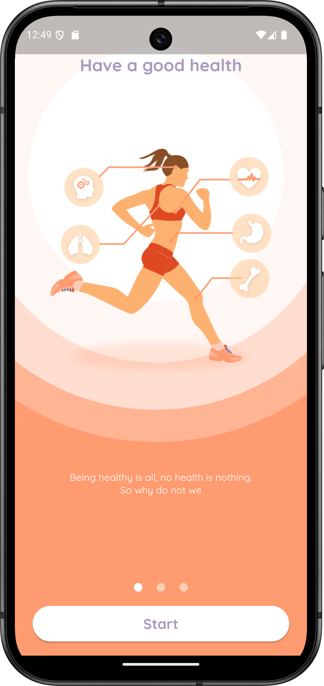
  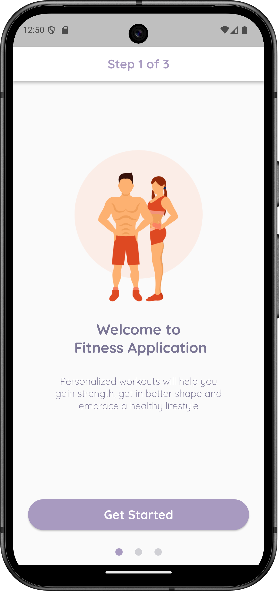
  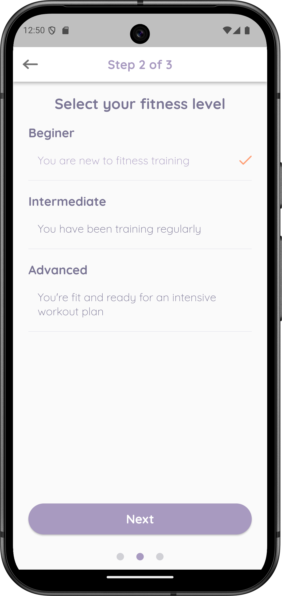
  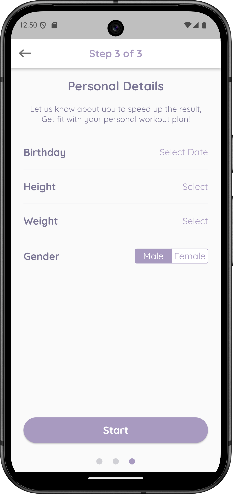
  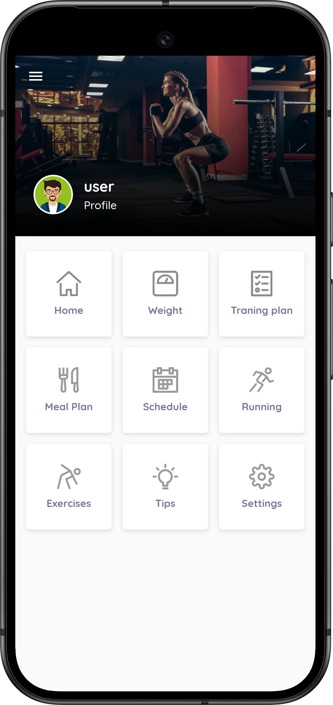
  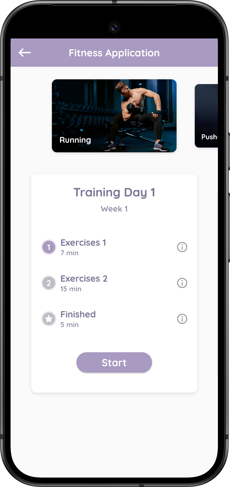
  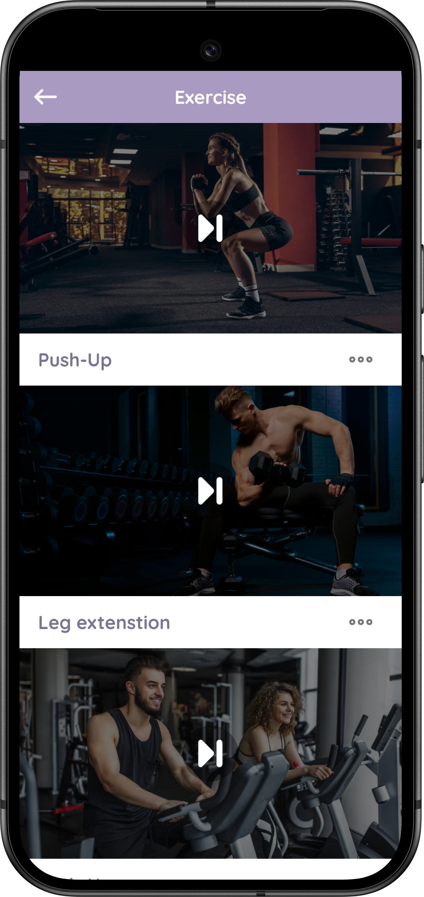
  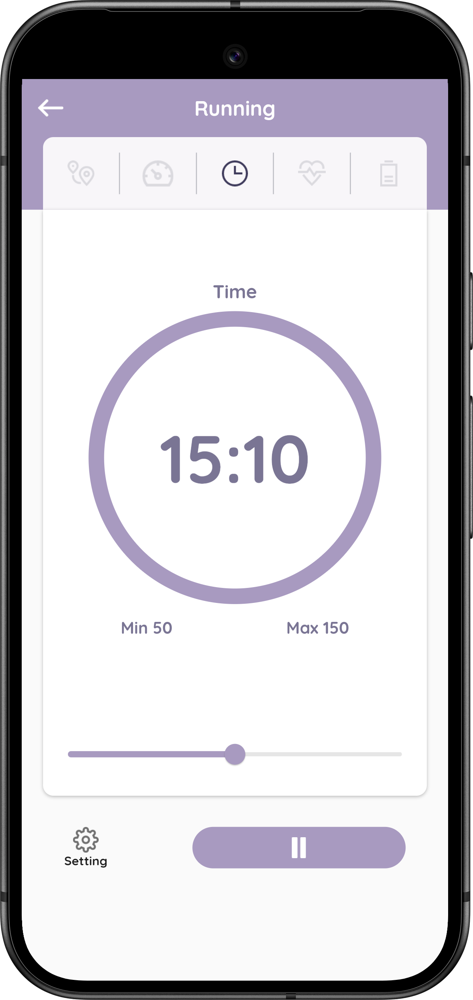
  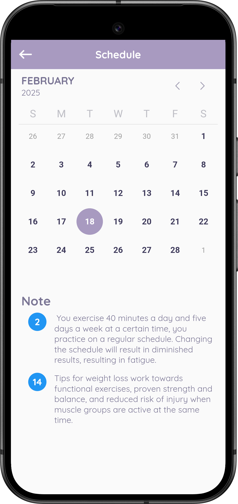
  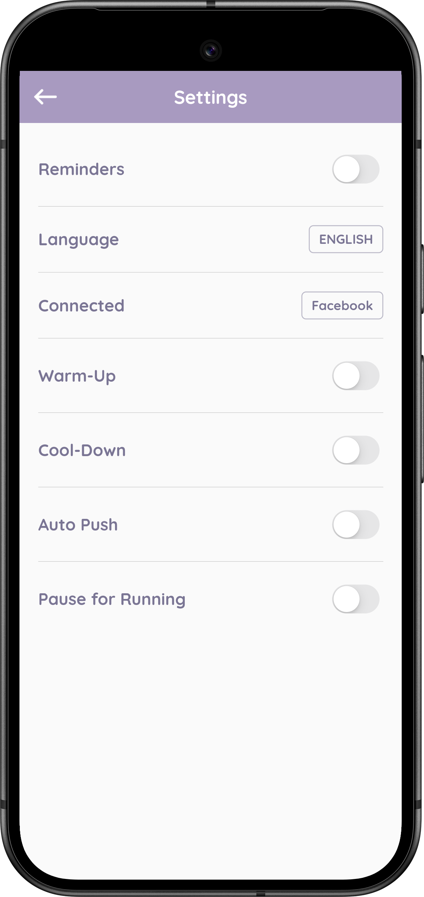
  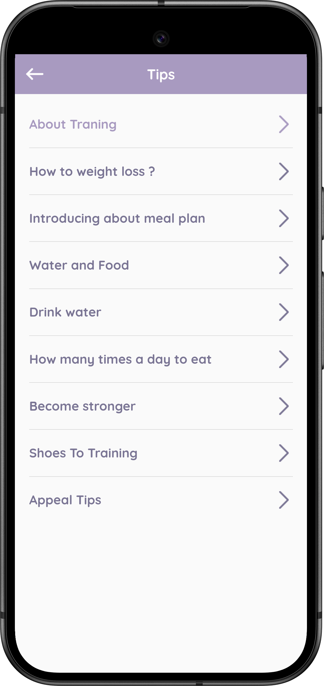
  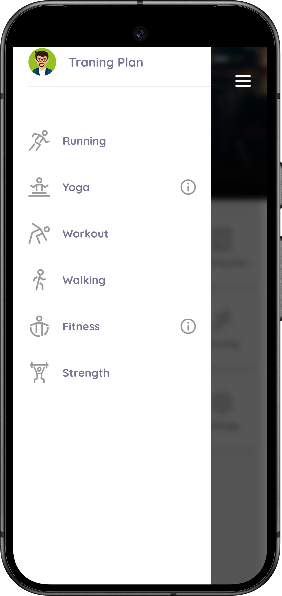
  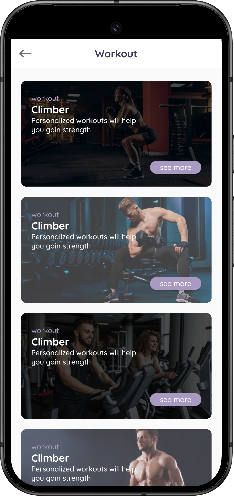
  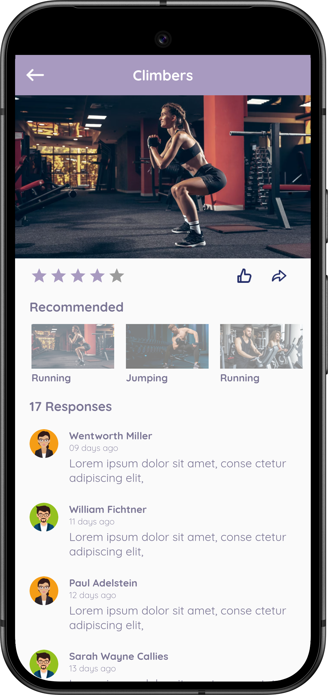
</p>

Uygulamanın tüm özelliklerini görmek için projeyi indirip deneyebilirsiniz! 🎯

---

## 🚀 Kurulum ve Kullanım

1️⃣ **Projeyi klonlayın:**
```bash
git clone https://github.com/kullanici/fitness-app.git
```

2️⃣ **Bağımlılıkları yükleyin:**
```bash
flutter pub get
```

3️⃣ **Uygulamayı çalıştırın:**
```bash
flutter run
```

> 📌 Not: Uygulamayı çalıştırmadan önce Flutter SDK ve ilgili araçların kurulu olduğundan emin olun.

---

